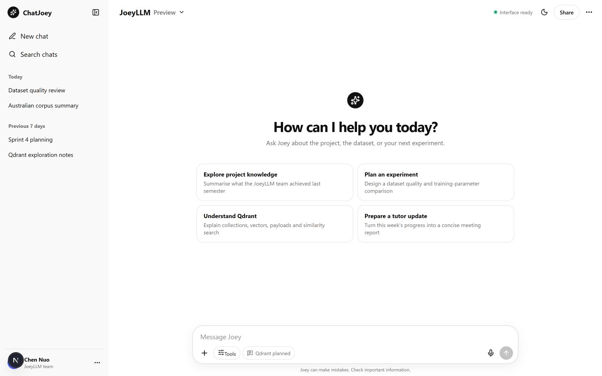
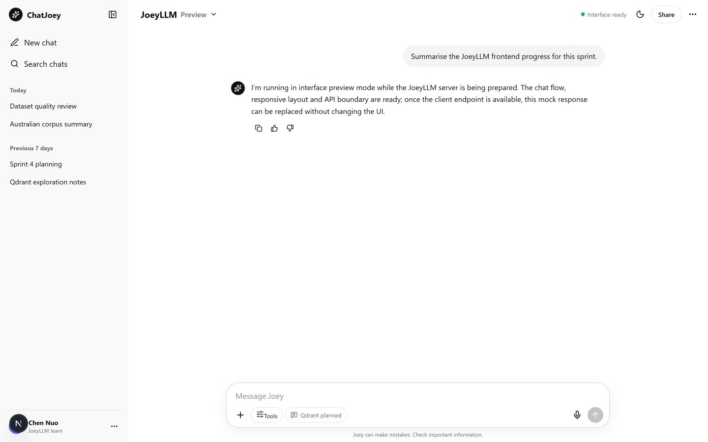
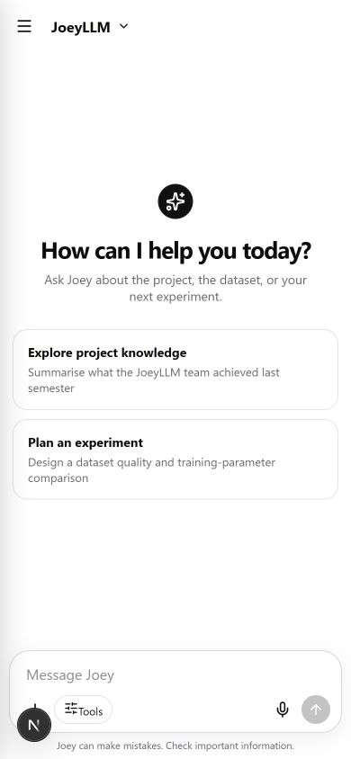
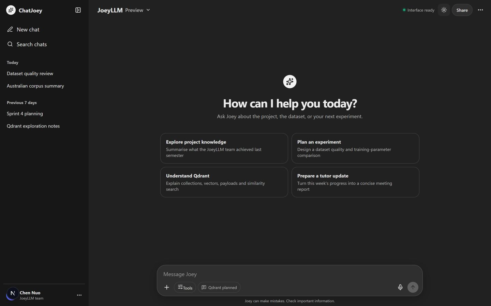
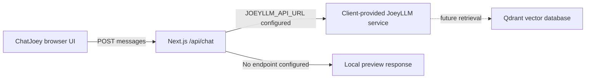

# ChatJoey

ChatJoey is the Next.js chat interface for JoeyLLM. It provides a responsive, ChatGPT-inspired conversation experience with distinct JoeyLLM branding and a server-side integration boundary ready for the client-provided model service.

> **Current status:** frontend prototype complete. The interface and mock chat flow work locally; the live JoeyLLM API, Qdrant retrieval, authentication, persistence, and Vercel deployment are not connected yet.

## Interface preview

### Desktop welcome screen

The desktop layout includes the conversation sidebar, project-focused starter prompts, service status, theme control, and message composer.



### Working conversation flow

Messages are submitted through the same `/api/chat` boundary that will later connect to the client service. Until that endpoint is available, the route returns an explicit preview-mode response.



### Responsive and theme support

| Mobile layout (390 × 844) | Dark theme |
| --- | --- |
|  |  |

## Implemented features

| Area | Status | Details |
| --- | --- | --- |
| Responsive chat layout | ✅ Complete | Desktop sidebar layout and mobile navigation at small breakpoints |
| Conversation composer | ✅ Complete | Send with the button or Enter; Shift+Enter remains available for a new line |
| Message flow | ✅ Complete | User and assistant messages, loading indicator, error feedback, and automatic scrolling |
| Starter prompts | ✅ Complete | Project knowledge, dataset experiments, Qdrant learning, and tutor-update prompts |
| Response actions | ✅ Complete | Copy, positive-feedback, and negative-feedback controls are represented in the UI |
| Conversation controls | ✅ Prototype | New chat, collapsible sidebar, history presentation, search/share/tool affordances |
| Themes | ✅ Complete | Runtime light/dark theme toggle |
| API boundary | ✅ Complete | Browser calls `/api/chat`; the Next.js route can forward requests to `JOEYLLM_API_URL` |
| Mock mode | ✅ Complete | Honest fallback response while the client model server is unavailable |
| Qdrant retrieval | 🟡 Planned | UI indicator and environment placeholders only; no vector search is performed yet |
| Deployment and accounts | 🟡 Planned | Vercel, authentication, and persistent chat storage remain future work |

## How it works



The frontend never calls the future model endpoint directly. Keeping the client URL on the server side means the team can replace preview mode without redesigning the interface or exposing backend configuration to the browser.

## Technology

- Next.js 16 App Router
- React 19
- TypeScript
- Lucide React icons
- Responsive CSS with light and dark design tokens
- Next.js route handler for the backend integration boundary

## Run locally

Requirements:

- Node.js 20 or newer
- pnpm

```bash
git clone https://github.com/joeyllm/ChatJoey.git
cd ChatJoey
git checkout chennuo
pnpm install
pnpm dev
```

Open [http://localhost:3000](http://localhost:3000).

The application works immediately in preview mode; a model server is not required to inspect or test the interface.

## Connect the client-provided JoeyLLM service

Copy `.env.example` to `.env.local` and set the server endpoint:

```dotenv
JOEYLLM_API_URL=https://your-client-service.example/api/chat
```

The Next.js route sends:

```json
{
  "messages": [
    { "role": "user", "content": "Summarise this week's progress." }
  ]
}
```

The upstream service should return either:

```json
{ "message": "Response text" }
```

or:

```json
{ "content": "Response text" }
```

Do not place client credentials in browser code. Any future secrets should remain in server-side environment variables.

## Qdrant integration status

Qdrant is deliberately not active in this prototype. Before implementation, the team still needs to agree with the client on:

1. embedding model and vector dimensions;
2. collection and payload schema;
3. chunking and metadata strategy;
4. retrieval filters and top-k evaluation;
5. local, client-hosted, or cloud deployment;
6. where retrieval is orchestrated in the client-provided model framework.

The placeholder variables in `.env.example` are:

```dotenv
QDRANT_URL=http://localhost:6333
QDRANT_API_KEY=
```

## Validation

Run the repository checks before submitting changes:

```bash
pnpm lint
pnpm typecheck
pnpm build
```

The current prototype has also been manually checked at desktop and 390 × 844 mobile sizes, in both colour themes, with an end-to-end mock message submission and no browser console errors.

## Next steps

- Confirm the live request and response contract with the client.
- Connect `JOEYLLM_API_URL` and test upstream error handling.
- Design and evaluate the dataset chunking and Qdrant retrieval strategy.
- Add persistent conversation storage and authentication if required.
- Connect the repository to Vercel and configure deployment environments.
- Add automated component and API-route tests as the integration stabilises.

## Project context

This prototype responds to the Sprint instruction to begin a Next.js chat interface, take inspiration from established conversational products, prepare the repository for later Vercel deployment, and develop an initial understanding of Qdrant. In line with the project scope, the client provides the model framework; the team can focus its ML work on dataset quality, retrieval design, and training parameters.
