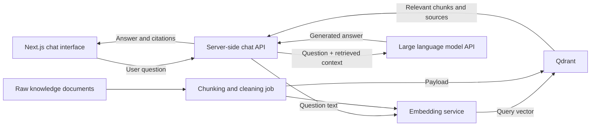

# Qdrant Basics and the ChatJoey Integration Boundary

This document supports future Retrieval-Augmented Generation (RAG) development for ChatJoey. It explains Qdrant's core concepts, the typical data flow, and the implementation boundary for this week's prototype. At this stage, ChatJoey does not install, start, or connect to Qdrant.

## 1. What Qdrant Is

Qdrant is a database and search engine for vector similarity search. It can store vectors generated from text, images, or other content, then retrieve the records whose vectors are closest to a query vector. In addition to vectors, Qdrant can store business metadata as JSON payloads and use that metadata for filtering during retrieval.

Qdrant is responsible for storing and retrieving relevant content. It is not a large language model, and it does not automatically generate final answers for a chat system.

## 2. Main Differences Between Vector Databases and Relational Databases

| Comparison Area | Traditional Relational Database | Vector Database, Using Qdrant As An Example |
| --- | --- | --- |
| Main data organisation | Tables, rows, columns, and relationships | Collections, points, vectors, and payloads |
| Typical queries | Exact conditions, ranges, sorting, aggregation, joins | Find the semantically closest top-k results by vector distance |
| Best suited for | Structured questions such as order status, user IDs, and financial totals | Semantic search, similar content, recommendations, and RAG retrieval |
| Indexing goal | Speed up field lookup and relationship joins | Speed up nearest-neighbour search in high-dimensional space; payload fields can also be indexed |
| Result meaning | Records that satisfy explicit conditions | Records with high similarity to the query vector, plus their scores |

The two database types do not replace each other. In real systems, relational databases often store users, permissions, sessions, and other transactional data, while Qdrant stores semantically searchable knowledge chunks and vectors.

## 3. The Role Of Embeddings

Embedding is the process of converting text or other content into a numeric vector. An embedding model tries to place semantically similar content closer together in vector space. For example, "how to reset my password" and "how can I recover a forgotten password" may produce nearby vectors even if they do not share exactly the same keywords.

When writing knowledge into the database and when querying it later, the system normally needs a compatible embedding model, the same vector dimension, and consistent preprocessing. Otherwise, the two groups of vectors cannot be compared reliably. Embeddings are produced by the selected model or service; Qdrant's core job is to store the vectors and perform retrieval.

## 4. Core Qdrant Concepts

### Collection

A collection is a group of points that can be searched together. When creating a collection, the system must define vector configuration such as vector dimension and distance metric. An application should plan collections according to data isolation and retrieval requirements, rather than creating a separate collection for every document.

### Point

A point is the basic record operated on by Qdrant. A point contains a unique ID, one or more vectors, and an optional payload. For a text knowledge base, one point can usually represent one chunk of text.

### Vector

A vector is the numeric representation of content, often generated by an embedding model. Qdrant supports dense vectors, sparse vectors, and multi-vector representations. Basic semantic retrieval usually starts with dense vectors.

### Payload

A payload is JSON metadata attached to a point. A text knowledge base can store the original text chunk, document ID, title, source, page number, update time, or permission tags in the payload. Payloads can be returned with search results and can also be used for filtering. They are not a replacement for the semantic representation in the vector.

A simplified logical example:

```json
{
  "id": "chunk-001",
  "vector": [0.12, -0.08, 0.31],
  "payload": {
    "documentId": "handbook-01",
    "title": "User Handbook",
    "text": "This is the original chunked text.",
    "section": "Account settings"
  }
}
```

The example vector only illustrates the data shape. It does not represent the dimension or output of a real embedding model.

## 5. Basic Vector Similarity Search Process

1. Use an embedding model compatible with the knowledge-ingestion process to convert the user's question into a query vector.
2. Select the target collection and add payload filters if needed, such as document scope or access permissions.
3. Qdrant compares the query vector with stored vectors using the distance metric configured for the collection.
4. The retrieval index finds the closest top-k points, avoiding a full record-by-record comparison at large scale.
5. Qdrant returns the matching points, similarity scores, and required payload fields.
6. The application can apply a score threshold, deduplication, or reranking before passing qualified chunks into the next stage.

Common distance metrics include cosine, dot product, Euclidean, and Manhattan. The metric should be selected according to the embedding model's recommendation, not switched casually based on name alone.

## 6. Basic Flow For Text Entering Qdrant

```text
Raw text
  -> text chunking
  -> embedding generation
  -> write vectors and payloads into Qdrant
  -> convert the user question into a vector
  -> run similarity search in Qdrant
  -> return relevant text chunks and metadata
```

Text is chunked so retrieval results stay specific while still preserving enough context to answer questions. Chunk size, overlap length, embedding model, and top-k all need to be evaluated with real data. This document does not assume values for configurations that have not been decided yet.

## 7. Qdrant's Role In Chat Systems And RAG

In a normal chat system, the model can only rely on the prompt, the current conversation, and its existing capabilities. RAG adds a retrieval step before answer generation: first search the knowledge base for content related to the question, then provide that content to the model as controlled context.

In that workflow, Qdrant mainly handles:

- storing vectors and source metadata for knowledge chunks;
- retrieving semantically related chunks based on the user's question;
- limiting the retrieval scope through payload filters;
- returning candidate context that the backend can use to organise prompts and citations.

Qdrant does not decide the final wording of an answer, and it cannot guarantee that retrieval results are automatically correct. The system still needs to handle data quality, access control, recall evaluation, prompt construction, citation handling, and model output validation.

## 8. Possible Future Architecture For ChatJoey



This architecture has two paths:

- **Knowledge ingestion path**: documents are cleaned and chunked, embeddings are generated, then vectors and payloads are written into Qdrant.
- **Chat query path**: the backend embeds the question and searches Qdrant, sends qualified chunks and the question to the model, then returns the answer and sources to the frontend.

The Qdrant address, access credentials, and model keys should only exist in controlled server-side environments. They should not be exposed in browser-side code. The components in the diagram are possible responsibility boundaries; they do not mean that a specific vendor, interface field, or deployment configuration has been finalised this week.

## 9. Implemented This Week And Not Yet Implemented

### Implemented This Week

- Next.js App Router and TypeScript project foundation;
- desktop and narrow-window chat layout built with CSS Modules;
- interface switching for English by default, plus French, Chinese, Russian, Spanish, and Japanese;
- title/product identity, welcome state, message area, input area, and send button;
- visual distinction between user and assistant messages;
- disabled empty input, Enter to send, and Shift + Enter for a new line;
- browser-session message state and real JoeyLLM replies;
- basic accessibility through input labels, button names, semantic structure, and keyboard interaction;
- Next.js server-side `/api/chat` proxy;
- connection to the real JoeyLLM API through server-side environment variables;
- server-side model discovery, streaming response consumption, and complete frontend reply display;
- Vercel server-side environment variable and deployment documentation.

### Not Yet Implemented

- document upload, cleaning, chunking, and ingestion jobs;
- embedding model selection, calls, and version management;
- Qdrant installation, collection configuration, connection, writes, or retrieval;
- RAG prompt assembly, citations, recall evaluation, and reranking;
- login, authentication, permission filtering, conversation persistence, or a database;
- browser-side token-by-token streaming. The server currently consumes the upstream stream and returns a complete reply.

## Official References

- [Qdrant Overview](https://qdrant.tech/documentation/overview/)
- [Collections](https://qdrant.tech/documentation/manage-data/collections/)
- [Points](https://qdrant.tech/documentation/manage-data/points/)
- [Vectors](https://qdrant.tech/documentation/manage-data/vectors/)
- [Payload](https://qdrant.tech/documentation/concepts/payload/)
- [Similarity Search](https://qdrant.tech/documentation/search/search/)
