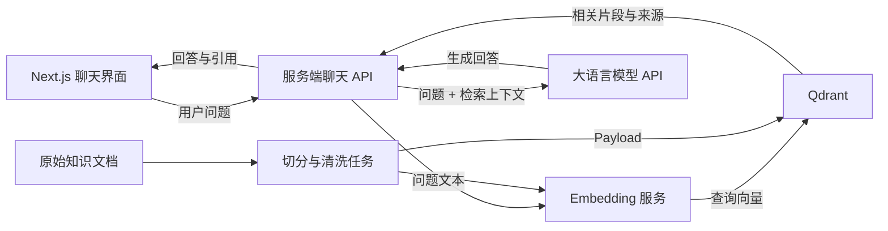

# Qdrant 基础说明与 ChatJoey 集成边界

本文面向 ChatJoey 的后续检索增强生成（Retrieval-Augmented Generation，RAG）开发，说明 Qdrant 的核心概念、典型数据流程和本周原型的实现边界。本阶段不安装、不启动、也不连接 Qdrant。

## 1. Qdrant 是什么

Qdrant 是面向向量相似度检索的数据库与搜索引擎。它可以保存由文本、图片或其他内容生成的向量，并从大量记录中找出与查询向量最接近的结果。除向量外，Qdrant 还能保存 JSON 形式的业务元数据，并在检索时结合元数据过滤。

Qdrant 负责的是“存储和找回相关内容”，它本身不等同于大语言模型，也不会自动替聊天系统生成最终回答。

## 2. 向量数据库与关系型数据库的主要区别

| 对比维度 | 传统关系型数据库 | 向量数据库（以 Qdrant 为例） |
| --- | --- | --- |
| 主要数据组织 | 表、行、列及关系 | Collection、Point、Vector、Payload |
| 典型查询 | 精确条件、范围、排序、聚合、Join | 按向量距离寻找语义上最接近的 Top-K 结果 |
| 擅长的问题 | 订单状态、用户 ID、金额统计等结构化问题 | 语义搜索、相似内容、推荐和 RAG 检索 |
| 索引目标 | 加速字段查找和关系连接 | 加速高维空间中的近邻搜索，也可为 Payload 字段建索引 |
| 结果含义 | 满足明确条件的记录 | 与查询向量相似度较高的记录及其分数 |

两类数据库并非互相替代。实际系统常用关系型数据库保存用户、权限、会话等事务数据，用 Qdrant 保存可语义检索的知识片段和向量。

## 3. Embedding 的作用

Embedding 是把文本等内容转换成一组数字向量的过程。Embedding 模型会尽量让语义相近的内容在向量空间中靠得更近，因此“怎么重置密码”和“忘记密码如何找回”即使没有完全相同的关键词，也可能得到相近的向量。

写入知识和查询问题时通常要使用兼容的 Embedding 模型、相同的向量维度和一致的预处理方式，否则两组向量不可直接可靠比较。Embedding 由选定的模型或服务产生；Qdrant 的核心职责是保存向量并执行检索。

## 4. Qdrant 核心概念

### Collection

Collection 是一组可共同搜索的 Point。创建 Collection 时需要定义向量配置，例如维度和距离度量。一个应用可以按数据隔离与检索需求规划 Collection，不应简单地为每一条文档创建一个 Collection。

### Point

Point 是 Qdrant 操作的基本记录。一个 Point 包含唯一 ID、一个或多个 Vector，以及可选的 Payload。对文本知识库来说，一个 Point 通常可以代表一个切分后的文本片段。

### Vector

Vector 是内容的数值表示，常由 Embedding 模型生成。Qdrant 支持稠密向量、稀疏向量和多向量等形式。基础语义检索一般先从稠密向量开始。

### Payload

Payload 是附加在 Point 上的 JSON 元数据。文本知识库可在其中保存原文片段、文档 ID、标题、来源、页码、更新时间或权限标签。Payload 既能随结果返回，也可用于检索过滤；它不是用来替代 Vector 的语义表示。

一个简化的逻辑示例：

```json
{
  "id": "chunk-001",
  "vector": [0.12, -0.08, 0.31],
  "payload": {
    "documentId": "handbook-01",
    "title": "使用手册",
    "text": "这是切分后的原文片段。",
    "section": "账户设置"
  }
}
```

示例向量只用于说明数据形态，不代表真实模型的维度或输出。

## 5. 向量相似度检索的基本过程

1. 使用与知识入库时兼容的 Embedding 模型，把用户问题转换为查询向量。
2. 选择目标 Collection，并按需添加 Payload 过滤条件，例如文档范围或访问权限。
3. Qdrant 按 Collection 配置的距离度量比较查询向量与已存向量。
4. 检索索引找出最接近的 Top-K Points，避免在大数据量下逐条完整比较。
5. 返回匹配 Point、相似度分数及所需 Payload。
6. 应用可设置分数阈值、去重或二次排序，然后把合格片段交给后续流程。

常见距离度量包括 Cosine、Dot Product、Euclidean 和 Manhattan。应根据 Embedding 模型的建议选择，不能仅凭名称随意切换。

## 6. 文本进入 Qdrant 的基本流程

```text
原始文本
  → 文本切分
  → 生成 Embedding
  → 将 Vector 与 Payload 写入 Qdrant
  → 将用户问题转换为向量
  → 在 Qdrant 中执行相似度搜索
  → 返回相关文本片段及元数据
```

文本切分的目的，是让检索结果保持足够具体，同时保留回答问题所需的上下文。切分大小、重叠长度、Embedding 模型和 Top-K 都需要通过实际数据评估，本文不预设这些尚未确定的配置值。

## 7. Qdrant 在聊天系统和 RAG 中的作用

在普通聊天系统中，模型只能依赖提示词、当前会话和自身已有能力。RAG 会在生成答案前增加检索步骤：先从知识库找出与问题相关的内容，再把这些内容作为受控上下文交给模型。

Qdrant 在其中主要承担：

- 保存知识片段的向量和来源元数据；
- 根据用户问题检索语义相关片段；
- 通过 Payload 过滤限制检索范围；
- 返回可供后端组织提示词和来源引用的候选上下文。

Qdrant 不负责判断最终回答措辞，也不能保证检索结果天然正确。系统仍需处理数据质量、访问控制、召回评估、提示词组织、引用和模型输出校验。

## 8. ChatJoey 未来可能采用的整体架构



该架构包含两条路径：

- **知识入库路径**：文档清洗与切分后生成 Embedding，再将 Vector 和 Payload 写入 Qdrant。
- **聊天查询路径**：后端将问题向量化并检索 Qdrant，把合格片段和问题一起交给模型，最后向前端返回回答与来源。

Qdrant 地址、访问凭据和模型密钥应只存在于受控的服务端环境，不应暴露在浏览器端代码中。图中的组件是可能的职责划分，不代表本周已经确定了具体供应商、接口字段或部署配置。

## 9. 本周已实现与尚未实现

### 本周已经实现

- Next.js App Router 与 TypeScript 项目基础；
- 基于 CSS Modules 的桌面端和窄窗口聊天布局；
- 英文（默认）、法语、中文、俄文、西班牙语和日语界面切换；
- 标题/产品标识、欢迎状态、消息区、输入区和发送按钮；
- 用户与助手消息的视觉区分；
- 空输入禁用、Enter 发送、Shift + Enter 换行；
- 浏览器会话内的消息状态和真实 JoeyLLM 回复；
- 输入标签、按钮名称、语义结构和键盘操作等基础可访问性；
- Next.js 服务端 `/api/chat` 代理；
- 通过服务端环境变量连接真实 JoeyLLM API；
- 服务端模型发现、流式响应消费和前端完整回复展示；
- Vercel 服务端环境变量与部署说明。

### 尚未实现

- 文档上传、清洗、切分与入库任务；
- Embedding 模型选择、调用和版本管理；
- Qdrant 安装、Collection 配置、连接、写入与检索；
- RAG 提示词组装、引用、召回评估和重排；
- 登录、鉴权、权限过滤、会话持久化和数据库；
- 浏览器端逐 Token 流式展示（当前由服务端消费流并返回完整回复）。

## 官方参考资料

- [Qdrant Overview](https://qdrant.tech/documentation/overview/)
- [Collections](https://qdrant.tech/documentation/manage-data/collections/)
- [Points](https://qdrant.tech/documentation/manage-data/points/)
- [Vectors](https://qdrant.tech/documentation/manage-data/vectors/)
- [Payload](https://qdrant.tech/documentation/concepts/payload/)
- [Similarity Search](https://qdrant.tech/documentation/search/search/)
